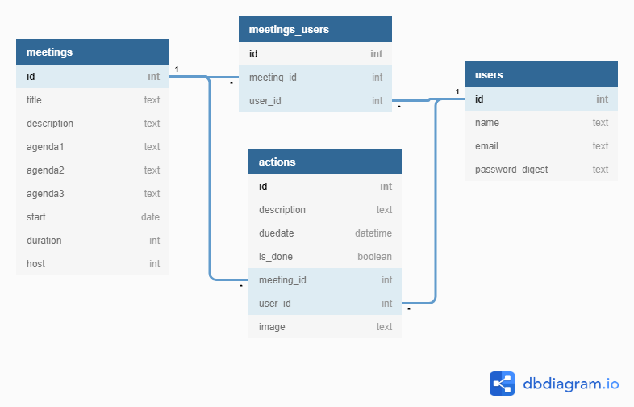

# Mind Meet

Make meetings meaningful - https://mind-meet.herokuapp.com

## Tools & Technologies
* Ruby on Rails
* Bootstrap
* Cloudinary
* Fontawesome
* Hereku
* CSS
* HTML

## Features

* User registration and login
* Scheduling a meeting
* Taking actions for each user
* Showing action progress
* Marking action as done
* Showing meeting info
* Updating meeting detalis
* Add participants in meeting

## Database design

## Screen designs

## Bugs

Please [report an issue](https://github.com/gopipatell/mind-meet/issues/new) in Github.  

## To Do list

* Taking Notes in meeting
* Sharing meeting in Google calender

## Thank you

[Rashida](https://github.com/rashidabengali)for helping me 😊	
